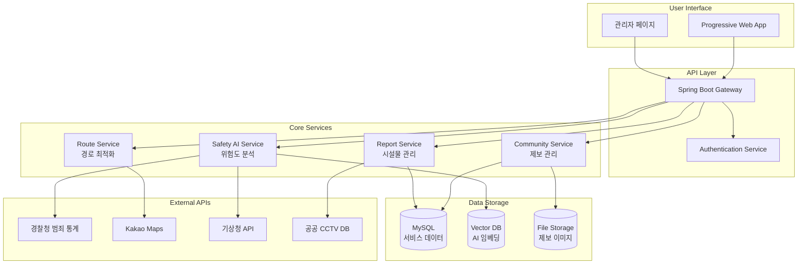

# MAPSPICY 🗺️🔥
**Safe Route Navigation & Community Platform for Women, Elderly, and Disabled**

[](LICENSE)
[](https://reactjs.org/)
[](https://spring.io/projects/spring-boot)
[](https://fastapi.tiangolo.com/)
[](https://docker.com)

> **2025 Capstone Design Final Project**  
> A comprehensive safety-first navigation platform addressing the sharp rise in random street crimes targeting vulnerable populations.

## 📊 Problem Statement - Real Data Analysis

### 🚨 Critical Statistics (2023 Police Data)

**더불어민주당 김승원 의원의 경찰청 제출 자료 분석 결과:**

- **2023년 1-8월 '이상동기 범죄' (묻지마 범죄): 23건 발생**
- **발생 장소 분석**: 
  - 노상(길거리): **20건 (87%)** 
  - 기타 장소: 3건 (13%)
- **발생 시간대 분석**:
  - 밤 8시 ~ 새벽 4시: **12건 (52%)**
  - 주간 시간대: 11건 (48%)

> **출처**: 인천일보 2023년 기사, 경찰청 공식 자료

### 🎯 핵심 문제점
1. **노상 범죄 집중**: 전체 범죄의 87%가 길거리에서 발생
2. **야간 취약 시간대**: 야간-새벽 시간대 범죄율 높음
3. **안전 경로 정보 부족**: 기존 내비게이션의 안전성 고려 부재
4. **실시간 위험 정보 부족**: 시민들의 위험 지역 정보 공유 체계 미비

## 💡 MAPSPICY Solution

이러한 현실적 문제를 해결하기 위해 **MAPSPICY**는:
- 📍 **노상 안전 인프라 매핑**: CCTV, 비상벨, 24시 편의점 위치 시각화
- 🌙 **야간 특화 안전 경로**: 시간대별 위험도를 반영한 최적 경로 제공
- 👥 **시민 참여형 안전 플랫폼**: 실시간 위험 지역 제보 및 공유 시스템
- 🤖 **AI 기반 위험도 분석**: 다양한 데이터를 종합한 지역별 안전 지수 산출

## ✨ 핵심 기능

### 🧭 스마트 안전 경로 안내
- **다중 경로 옵션**: 최단/최안전/균형 경로 제공
- **실시간 안전 가중치**: 시간대, 날씨, 신고 현황 반영
- **야간 특화 알고리즘**: 조명, CCTV 밀도를 우선 고려
- **음성 안내**: 핸즈프리 네비게이션으로 주변 경계 유지

### 🗺️ 인터랙티브 안전 지도
- **24시간 편의점 표시**: 응급상황 시 피난처 역할
- **CCTV 커버리지**: 감시 영역 시각화로 안전한 구간 확인
- **비상 인프라**: 경찰서, 비상벨, 안전 지대 실시간 표시
- **위험도 히트맵**: 시간대별 지역 위험도 색상 구분

### 👥 커뮤니티 제보 시스템
- **시설물 파손 건의**: 파손된 가로등, CCTV, 비상벨 신속 신고
- **위험 경로 건의**: 시민이 직접 경험한 위험 지역 정보 공유
- **사진 증거 첨부**: GPS 좌표와 함께 현장 상황 기록
- **관리자 검증 시스템**: 2단계 검토를 통한 신뢰성 있는 정보 관리

### 📊 관리자 페이지
- **제보 관리**: 시민 신고 내용 승인/반려 처리
- **통계 대시보드**: 지역별, 시간별 안전 현황 분석
- **시설물 상태 모니터링**: 공공 안전 인프라 점검 현황
- **긴급 알림 발송**: 위험 상황 발생 시 해당 지역 사용자 알림

## 🛠️ 기술 스택


## 🏗️ 시스템 아키텍처




## 🚀 주요 화면 구성

### 메인 대시보드
- **실시간 안전 지도**: 현재 위치 기준 주변 위험도 시각화
- **빠른 경로 검색**: 목적지 입력으로 즉시 안전 경로 제공
- **오늘의 안전 정보**: 지역별 안전 지수와 주의사항

### 시설물 파손 건의 페이지
- **간편 신고 인터페이스**: 사진 촬영 → GPS 자동 태깅 → 설명 작성
- **카테고리 분류**: 가로등, CCTV, 비상벨, 기타 시설물 구분
- **처리 상태 추적**: 신고 → 검토 → 처리 완료까지 진행 상황 확인

### 위험 경로 건의 페이지  
- **경로 지정**: 지도상에서 위험 구간 직접 표시
- **위험 요소 태깅**: 조명 부족, 인적 드문 곳, 사각지대 등 분류
- **시간대 정보**: 위험을 경험한 구체적 시간대 기록

### 관리자 페이지
- **제보 관리 대시보드**: 미처리 신고 목록과 우선순위 표시
- **지역별 통계**: 제보 빈도와 처리 현황 시각화
- **긴급 공지 시스템**: 특정 지역 위험 상황 시 즉시 알림 발송

## ⚙️ 로컬 실행 방법

### 사전 요구사항
- Docker Desktop 4.20+
- Node.js 18+ (개발용)
- Git

### 빠른 시작

```bash
# 1. 저장소 클론
git clone https://github.com/your-team/mapspicy.git
cd mapspicy

# 2. 환경 변수 설정  
cp .env.sample .env
# .env 파일에서 API 키와 데이터베이스 정보 입력

# 3. 전체 서비스 실행
docker-compose up -d --build

# 4. 서비스 상태 확인
docker-compose ps
```

### 접속 정보
- **웹 애플리케이션**: http://localhost:3000
- **관리자 페이지**: http://localhost:3000/admin  
- **API 문서**: http://localhost:8080/swagger-ui.html
- **AI 서비스**: http://localhost:8001/docs

## 📊 예상 성과 및 임팩트

### 안전성 개선 목표
- **노상 범죄 노출 위험 30% 감소**: 안전 경로 이용 시
- **신고 처리 시간 단축**: 평균 24시간 → 6시간 이내
- **시민 참여율 증대**: 월 1,000건 이상 제보 목표

### 사회적 가치
- **취약계층 보호**: 여성, 노약자, 장애인의 안전한 이동권 보장
- **지역사회 협력**: 시민 참여형 안전 네트워크 구축  
- **공공 안전 향상**: 데이터 기반 치안 정책 수립 지원

## 🛣️ 향후 발전 계획

### Phase 1: 플랫폼 안정화 (2025년 상반기)
- 베타 테스트를 통한 사용성 개선
- 지자체 협력을 통한 공공 데이터 연동
- AI 모델 정확도 향상

### Phase 2: 기능 확장 (2025년 하반기)  
- **실내 지도 서비스**: 지하철역, 대형 건물 내부 안전 경로
- **AI 챗봇**: "○○역까지 가장 안전한 길 알려줘"
- **다국어 지원**: 외국인 관광객 대상 서비스 확대

### Phase 3: 스마트 시티 연계 (2026년)
- **실시간 CCTV 연동**: 공공 감시 카메라 실시간 모니터링
- **IoT 센서 네트워크**: 환경 위험 요소 자동 감지
- **Apple Vision Pro 지원**: 공간 컴퓨팅 기반 AR 네비게이션

## 👥 팀 구성

### 개발팀
- **[팀장]**: 프로젝트 기획 및 풀스택 개발
- **[백엔드 개발자]**: Spring Boot API 및 데이터베이스 설계  
- **[프론트엔드 개발자]**: React 웹 애플리케이션 및 UI/UX
- **[AI 엔지니어]**: 머신러닝 모델 개발 및 데이터 분석
- **[DevOps 엔지니어]**: 인프라 구축 및 CI/CD 파이프라인

### 자문 및 협력
- **지도교수**: 알고리즘 최적화 및 연구 방향 조언
- **지역 경찰서**: 현장 데이터 제공 및 실용성 검증
- **시민 안전 단체**: 사용자 요구사항 분석 및 테스트 참여

## 📄 라이선스 및 문의

- **프로젝트 라이선스**: MIT License
- **문의 이메일**: mapspicy.team@gmail.com
- **GitHub Repository**: https://github.com/your-team/mapspicy
- **프로젝트 데모**: https://demo.mapspicy.com

---

<div align="center">
  
**"모든 시민의 안전한 귀가를 위해"**

*Built with ❤️ by MAPSPICY Team*  
*2025 Capstone Design Project*

</div>


